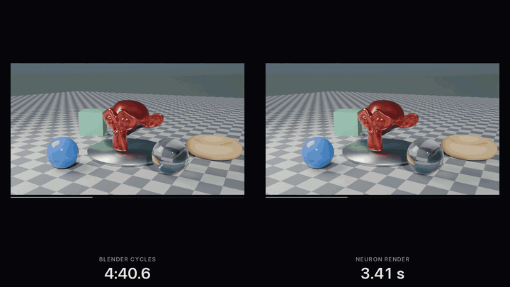

# Neuron Render

A neural approximation of Blender's Cycles. Point it at a `.blend`: it compiles the scene, lets Cycles
teach a small network what the scene looks like, and from then on renders frames in milliseconds, with a
dial that trades speed against quality. One fit can cover a frozen scene seen from any angle, or the
file's whole animation with its lights and materials left adjustable.



*The 120-frame animation rendered by Blender (13 min 56 s) and by the fit (10.9 s), then its lights and
materials changed live. Full video: [stage_parametric.mp4](https://github.com/MildyNora/neuron-render/releases/download/v0.1.0/stage_parametric.mp4);
the deforming-mesh scene: [ripple_parametric.mp4](https://github.com/MildyNora/neuron-render/releases/download/v0.1.0/ripple_parametric.mp4);
the four static scenes racing Blender: [scenes_compare.mp4](https://github.com/MildyNora/neuron-render/releases/download/v0.1.0/scenes_compare.mp4).*

```
uv venv --python 3.12 .venv && uv pip install --python .venv/bin/python -e .

neuron-render fit    scenes/mori.blend                    # once per scene (minutes)
neuron-render render scenes/mori.blend -o frame.png       # the scene camera, default quality
neuron-render render scenes/mori.blend --azimuth 120 -q fast
neuron-render orbit  scenes/mori.blend -o turntable.mp4
neuron-render bench  scenes/mori.blend --gpu              # Blender vs the network, same frame

neuron-render fit     scenes/stage.blend --vary time,lights,materials   # one fit for the animation, lights, materials
neuron-render animate scenes/stage.blend -o stage.mp4
neuron-render render  scenes/stage.blend --frame 40 --set Paint.base_color=0.1,0.3,0.8 --light Sun.energy=1

python demo/make_video.py scenes/mori.blend               # one scene: race, wipe, quality dial
python demo/make_comparison.py scenes/*.blend             # all scenes racing at once + summary
python demo/make_parametric.py scenes/stage.blend         # animation, relighting, repainting, unseen states
```

Needs an Apple-silicon Mac (the hot path is Metal), Blender 4.1 or newer (found on `PATH`, in `/Applications`, via
Spotlight, or set `NEURON_RENDER_BLENDER`) and, for videos, `ffmpeg`.

The fitted bundles are not in the repository (they are large); every number below is reproduced by running
`fit` on the `.blend` files in `scenes/`. The videos are attached to the GitHub release.

## How it works

1. **Compile** (`bl/compile_scene.py`, runs inside Blender). Geometry with modifiers applied, materials,
   lights and camera are flattened into arrays. Blender's whole colour pipeline (exposure, look, view
   transform, display) is baked into a 3D LUT by pushing a colour lattice through Blender's own save path.
   The compiled scene is then checked against Cycles: one sample through every pixel centre must land
   where our rasterizer says it does (100% of pixels on all five test scenes).
2. **Teach** (`fit.py`). Cycles renders ~200 views from a band of camera poses around the subject. Two
   things are fitted to them:
   - a **lightmap**: position alone -> radiance. It takes seconds, and bakes texture, shadow and bounce light;
   - the **network**: per shading point, analytic features -> radiance. The features are where the
     "compiled pipeline" lives: normal, view and mirror directions, material parameters, the lightmap
     value, a multiresolution hash grid, a learned code per triangle, per-light diffuse and highlight
     estimates, and **traced secondary rays** (a BVH ray tracer in a Metal kernel): what the reflection
     hits, where a ray refracted through glass finally lands after any number of glass surfaces, and
     whether those rays meet a light. Where a traced ray lands, it reads the lightmap.

   So the network is told where light *goes* and what is there, and only has to learn how it combines.
   Training runs through the exact pixel filter the renderer uses, so sub-pixel geometry is supervised correctly.
3. **Render** (`render.py`). A native rasterizer (`native/raster.c`) finds the visible triangle at
   several samples per pixel and collapses them into shading groups, one network evaluation per visible
   triangle per pixel block (per pixel where block shading would show). Metal kernels build the features and trace
   the hint rays, the MLP runs in half precision, and a last kernel filters the result and applies the LUT.

## Four scenes

| scene | what it stresses | Blender, as the file | Blender, GPU | Neuron | speed-up | accuracy: Neuron / Blender |
|---|---|---:|---:|---:|---:|---:|
| `mori` (900x1000, 24 spp) | faceted crystal, studio lights | 6.86 s | 2.25 s | 20.0 ms | 343x | 39.4 / 43.4 dB |
| `stage` (960x540, 64 spp) | sun + sky, checker texture, glass ball, metal | 6.19 s | 1.74 s | 25.3 ms | 245x | 37.8 / 45.6 dB |
| `cornell` (900x900, 64 spp) | bounce light from an emissive panel, mirror ball | 16.49 s | 3.97 s | 17.5 ms | 943x | 37.8 / 43.0 dB |
| `glassware` (1200x800, 64 spp) | clear, tinted and frosted glass, caustics | 12.58 s | 3.15 s | 29.5 ms | 426x | 32.3 / 36.4 dB |

`mori` and `stage` are existing files, used as they are (the skull in `mori` is Vladimir Petkovic's CC0
ScatteringSkull from the glTF sample assets, simplified and rematerialed). `cornell` and `glassware` are built by
`scenes/make_scenes.py` with `stage`'s render settings. All four render on the CPU as saved; the speed-up
column is against that, and the GPU column shows what switching Cycles to Metal would buy.

How the numbers were taken, on an M5 MacBook that was also doing other work: Blender is the best of 5 runs
of `blender -b file -f 1` (its own reported render time), the network is the median of 40 frames at the
default `balanced` setting with pixels delivered to host memory. Accuracy is PSNR against a converged
1024-sample Cycles render, averaged over held-out camera poses: views training never saw, nor anything
within 3 degrees of them. The Blender figure is the file's own render scored the same way.

One-time fits took 9 to 17 minutes per scene (Cycles teacher renders plus training).

## The dial

`-q` picks a preset; `--aa`, `--rate`, `--scale`, `--full` set the parts directly. On `mori`:

| preset   | what it does                                   | frame   | vs Blender | accuracy |
|----------|------------------------------------------------|---------|-----------:|---------:|
| draft    | half resolution, shade once per 4x4 block      | 6.8 ms  |      1009x |  38.3 dB |
| fast     | 2x2 visibility samples, shade once per 4x4     | 11.0 ms |       624x |  39.2 dB |
| balanced | 2x2 visibility samples, shade once per 2x2     | 20.0 ms |       343x |  39.4 dB |
| high     | 4x4 visibility samples, shade every pixel      | 56.5 ms |       121x |  39.5 dB |
| ultra    | shade every visibility sample                  | 159 ms  |        43x |  39.6 dB |

Block shading is only applied where shading is smooth: textures and curved glossy surfaces (glass, polished
metal) are shaded per pixel at every setting. So on `mori`, all flat facets, the cheap settings lose almost
nothing and are much faster; on `stage`, mostly textured floor, `fast` is barely quicker than `balanced`,
and `draft` (half resolution) drops to 33.6 dB against 37.8.

## One fit that covers changes

A fit made with `--vary` is not tied to one frozen scene. The same network renders any frame of the file's
animation, with any lamp recoloured or dimmed and any material repainted or made rougher or smoother,
without going back to Blender:

```
neuron-render fit     scenes/stage.blend --vary time,lights,materials     # once
neuron-render animate scenes/stage.blend -o stage.mp4                     # the file's animation, its own camera
neuron-render render  scenes/stage.blend --frame 40 \
      --set Paint.base_color=0.1,0.3,0.8 --set Paint.roughness=0.15 \
      --light Sun.energy=1 --light Sun.color=1,0.7,0.4 --light World.strength=0.3
neuron-render info    scenes/stage.blend --parametric                     # which lights and materials it knows
```

Each kind of change is handled by what it is physically, and as little as possible is left to learning:

- **Lights are exact.** Light adds up: a picture is the sum of one picture per light. The teacher renders
  one image per lamp and one for the world (Cycles light groups, every lamp white), the network predicts
  one radiance per group, and a lamp's colour and strength are just the weights of that sum, applied when
  the frame is resolved. Any colour and any strength, at no cost, including ones never rendered.
  Recombined groups match an ordinary Cycles render to 0.4%.
- **Time is compiled.** Geometry is exported for every frame (rigid motion as a transform, deforming
  meshes as vertex tables) with a ray-tracing BVH per frame, and everything analytic is recomputed for
  the frame being drawn: where reflection rays land, which lamps a point can see. What is learned lives in
  the object's reference pose, so it travels with the object; a few extra grid levels are four-dimensional
  (position and time) for what really changes, such as the soft shadow that follows a moving ball.
- **Materials are inputs.** Base colour and roughness of every Principled material are fed to the network,
  and the teacher renders the scene with random repaints so the network sees what they do.

Once things move, the network can no longer memorise, place by place, what its traced hints get wrong, so
for these fits the hints are made right instead. The world shader is baked into an environment map (six
Cycles renders of the world alone) and every reflection or refraction ray that leaves the scene reads it;
a rough metal's reflection is the average of 16 rays drawn from its GGX lobe; and a traced ray that lands
on metal or glass is followed once more, so a mirror seen in a mirror shows what it reflects from there.

On `stage` (120 frames: the monkey and its turntable turn, a ball slides across, the camera travels ten
metres) one fit took 57 minutes: 19 of Cycles rendering 479 teacher views, 38 of training. After that:

| | Blender, as the file | Blender, GPU | Neuron |
|---|---:|---:|---:|
| the 120-frame animation | 13 min 56 s | 3 min 31 s | 10.9 s |
| per frame | 6.96 s | 1.76 s | 91 ms |

| state the fit never saw | Neuron | Blender's own render |
|---|---:|---:|
| the scene camera, a pose kept out of training | 34.9 dB | 44.8 dB |
| five frames of the animation withheld entirely | 36.0 dB | 44.1 dB |
| withheld frames with every light and several materials changed (four states) | 33.3 dB | 44.1 dB |

Same yardstick as above: PSNR against a converged 1024-sample Cycles render of exactly that state. The
animation's time is the first pass through its frames, with each frame's triangle table and BVH built on
the way (12 ms of the 91; a frame seen before costs 70 ms); it is the median of three passes, and
Blender's is a single `blender -b -a` run.

The dial works here too, and has one more part: `--lobe`, the number of rays in a rough metal's reflection.

| preset   | frame | accuracy (mean of the ten held-out states) |
|----------|------:|---------:|
| draft    | 23 ms | 31.7 dB |
| fast     | 54 ms | 34.4 dB |
| balanced | 70 ms | 34.8 dB |
| high     | 135 ms | 34.9 dB |
| ultra    | 309 ms | 35.2 dB |

What the generality costs, against the plain fit of the same scene: about 3 dB (34.9 against 38.0 on the
scene camera), three times the frame time, five times the fitting time.

`ripple` (`scenes/make_scenes.py`; 640x400, 40 frames) checks the same machinery where meshes change
shape: a sphere with a wave travelling over it, a cylinder that bends over, a cube that tumbles across,
a drifting camera. Its fit took 20 minutes (464 teacher views); at `balanced` it scores 43.8 dB on the
held-out scene camera, 41.9 dB on five withheld frames and 37.4 dB on withheld frames with the lights
and materials changed, against 56 dB for Blender's own render of this simple scene; its 40 frames take
Blender 1 min 23 s (35 s on the GPU) and the network 0.59 s (`demo/ripple_parametric.mp4`).

## In a game engine (Unity)

A fitted scene can be carried into Unity and rendered there by the same network, from the Unity camera,
with its frame, lights and materials as component properties. `unity/NeuronRender` is a Unity 6 project
(built-in render pipeline); the kernels are the Metal ones ported to HLSL compute, the pack format is plain
arrays plus JSON, so nothing of PyTorch or Metal is needed at runtime.

```
neuron-render export scenes/stage.blend --parametric -o scenes/stage.nrpack   # 247 MB of tables, pack.json
# open unity/NeuronRender in Unity 6 (6000.x), open Assets/Scenes/NeuronDemo.unity, press Play
```

`NeuronRenderer` sits on a camera: point `packPath` at a pack, pick a preset, and the camera's image is the
fitted scene. Lights (energy, colour, world strength) and editable materials (base colour, roughness)
appear as lists in the inspector and can be driven from scripts; `frame` scrubs the animation.
`NeuronDemoUI` adds an on-screen panel for all of that (Tab hides it, Space plays the animation). The scene
coordinates are Blender's (Z up): a Unity position (x, y, z) is Blender (x, z, y).

Checked against the Python renderer on the same frames, same inputs: the Unity port agrees to 57-61 dB on
`stage` (reference frame, an animated frame, an edited state, and through the camera component) and 77 dB on
`mori`; what remains is rasterizer edge rounding. It is slower than the Metal path for now: at 960x540,
`balanced` costs about 130 ms a frame on the M5 (encode kernel ~70%, the MLP as a tiled matrix product ~25%),
against 70 ms in Python. Headless checks: `Unity -batchmode -projectPath unity/NeuronRender -executeMethod
NeuronRender.Editor.NeuronValidate.Run -quit -nrpack scenes/stage.nrpack -nrframe 0 -nrout /tmp/f.png`.

What it is in an engine: a baked, relightable, repaintable scene that renders from any camera in its band.
It does not light or shadow the engine's own objects, and it is still one fit per scene.

## What it is not

- **Not a general renderer.** A fit belongs to one file. A plain fit freezes the scene and covers a band
  of camera poses (by default a full orbit, +-6 degrees of elevation, +-8% of distance around the scene
  camera; `--azimuth-span` narrows it for scenes you cannot walk around, like the Cornell box). A `--vary`
  fit covers the frames that were compiled, each lamp's colour and strength and the world's strength, and
  each material's base colour and roughness, seen from a band around the camera's own path. Outside that
  it degrades, and anything else means fitting again: moving or resizing a lamp, metalness, transmission,
  textures, new objects, a mesh whose triangle count changes during the animation.
- **Not as accurate as Cycles.** 4 to 8 dB behind Blender's own render for a plain fit, 8 to 11 dB for one
  that covers changes. It is weakest on glass with rich internal light paths (the amber ring in
  `glassware` comes out too dark), on small glints and caustics seen through glass, on blurred
  reflections in rough metal, and, in a `--vary` fit, on metals after an edit: a surface turned from
  brushed to mirror, or from mirror to matte, is rendered plausibly rather than accurately (the two test
  states that do this to both metals score 32 dB), and the colour one object bounces onto its
  neighbours lags behind a repaint.
- **Not free for a single frame.** One frame from a cold start costs 1 to 2 s (process start, model
  load, first frame), and before that comes the fit. Against the files' own settings a plain fit pays for
  itself after roughly 40 to 100 frames, the `--vary` fit of `stage` after about 500: turntables,
  animation, interactive viewing, trying out lights and materials.
- **Not widely tested where it covers changes.** Two scenes so far, `stage` and `ripple`.
- Perspective cameras only; whole frames only (no sub-frame times). Depth of field, motion blur and
  compositor nodes are ignored (the fit says so). The world is baked once, so a sky that is itself animated
  is not followed. Textures are learned from the teacher renders at the output resolution, not read from
  the node graph, so they soften if you render larger than you fitted, and a textured material can have
  its roughness changed but not its colour.

## Layout

```
neuron_render/bl/            scripts that run inside Blender (scene compiler, Cycles teacher)
neuron_render/native/        the rasterizer (C, built on first use)
neuron_render/kernels.py     Metal kernels: features, ray tracer, lightmap, hash grid, resolve, view transform
neuron_render/model.py       the network and the lightmap
neuron_render/plan.py        which views, frames and material states the teacher renders, and which are held out
neuron_render/environment.py the world shader baked into an environment map
neuron_render/fit.py         dataset, training, held-out scoring
neuron_render/render.py      the renderer and the quality presets
neuron_render/export.py      the portable pack a fitted scene is exported as
scenes/                      the five .blend files, make_scenes.py, and the fitted bundles (<name>.neuron, <name>.parametric.neuron)
demo/                        the videos and the scripts that build them
unity/NeuronRender/          the Unity 6 runtime: HLSL compute ports of the kernels, NeuronRenderer, a demo scene
```

## License

MIT. The test scenes are included under the same terms; see the credit above for the skull geometry.
